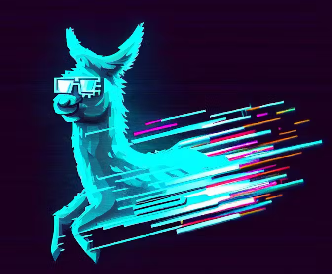

# Hackster - Pervasive AI Developer Contest with AMD


## Table of Contents

1. [Introduction](#introduction)
2. [The Proposal](#the-proposal)
3. [Rules and Judging](#rules-and-judging)
    1. [Hardware/Software Build Requirements](#hardware-software-build-requirements)
    2. [Project Documentation Requirements](#project-documentation-requirements)
    3. [Judging Criteria](#judging-criteria)
4. [Journals](#journals)
5. [AMD Accelerator Cloud](#amd-accelerator-cloud)
6. [Resources](#resources)

## Introduction

In late 2023, Hackster.io announced the **Pervasive AI Developer Contest** with [AMD as a partner](https://amd.com/).  The [contest page](https://www.hackster.io/contests/amd2023) described a number of prizes, and the opportunity to be awarded AMD hardware for AI development.

I had recently lead a Hackathon team focused on AI/LLM and had started learning more about it. I tested out using [K8sGPT](https://k8sgpt.ai/), which is a tool for scanning your Kubernetes clusters, diagnosing and triaging issues in simple english. I had originally used it with the OpenAI GPT-4 backend to successfully diagnose cluster issues.

I was curious about using it with local LLMs, and K8sGPT supports [multiple backends](https://docs.k8sgpt.ai/reference/providers/backend/), including [LocalAI](https://localai.io/), which is a local model, in an OpenAI compatible API.

I run a [fairly extensive homelab](https://www.linuxtek.ca/2023/03/07/kwlug-presentation-march-2023-homelab-tour/), and have multiple servers with ample resources to run a local [Kubernetes](https://kubernetes.io/) cluster. I had also recently build a [brand new workstation](https://www.linuxtek.ca/2024/04/08/after-12-years-new-desktop-workstation/), which was fully AMD based, and had enough resources to run an [AMD Radeon Pro W7900 Professional](https://www.amd.com/en/products/graphics/workstations/radeon-pro/w7900.html) GPU to test Large Language Models (LLM) locally.

I had been interested in automating and building on my homelab, and this contest was a fun way to motivate me to experiement with these tools.

This repository will contain all of the work, code, and insights I gain as I go thorugh the process.

## The Proposal


[My Proposal](https://www.hackster.io/contests/amd2023/hardware_applications/16336) for the contest was to set up a local Kubernetes cluster, and set up [K8sGPT](https://k8sgpt.ai/) to use [LocalAI](https://localai.io/) instead of a cloud-based LLM, powered by AMD AI hardware.

I submitted my proposal for **Category 1: Generative AI with AMD GPUs** in November 2023.

My hope is that as I get things working, I'm able to contribute back to some of these projects, and test some additional functionality than what is currently built in. I will document all progress in my [journals](./journals/), and the relative section README files.

## Rules and Judging

The [contest website rules](https://www.hackster.io/contests/amd2023/rules#challengeNav) has a number of requirements to provide for the judging section.  To ensure I have fulfilled these requirements, I am adding these sections.

### Hardware/Software Build Requirements

**Project Category:** Generative AI - Cloud
* For this category, we want to see developers create unique applications that solve real-world problems utilizing the ROCm software combined with either an AMD Instinct™ MI210 accelerator card via cloud access or an AMD Radeon™ PRO W7900 graphics card.

**Project AMD Hardware:**

* Use AMD Instinct MI210 Accelerator via Cloud Access or AMD Radeon PRO W7900 GPU
* Use AMD ROCm Software 

**Problem To Solve:**
* ML Ops Developers: end-to-end generative AI workflows: fine-tuning on pre-trained models, vector databases, agents, retrieval augmented generation (RAG)
* Instead of using OpenAI or cloud based LLM, configure K8sGPT to use a self-contained, locally hosted AI.
* Configure [LocalAI](https://localai.io/) and [K8sGPT](https://k8sgpt.ai/) to diagnose local Kubernetes cluster issues, leveraging AMD GPU hardware, and ROCm software.
* Contribute to the projects, adding additional analyzers and/or integrations.

### Project Documentation Requirements

```
Your project must include a project name, short project description, cover image, bill of materials (BOM), full instructions, images, and relevant resource files (schematics CAD, commented code, reference models, etc.).
Your project must be written in English.
Your project must be submitted by July 31th, 2024.
```
The contest submission was made in [this Hackster post](https://www.hackster.io/jason-paul/local-kubernetes-cluster-troubleshooting-assistant-4f7952)

### Judging Criteria

Your project will be judged according to the rubric below.

**Project Documentation (30 points)**
* Story/Instructions - Show how you created your project, including images, screenshots, and/or a video demonstration of your solution working as intended. Ask yourself: “If I were a beginner reading this project, would I understand how to recreate it?”

**Complete BOM (10 points)**
* Detail the hardware, software and/or tools used.

**Code & Contribution (30 points)**
* Include working code with helpful comments.

**Creativity (30 points)**
* Your idea doesn’t have to be original, but it should be creative (a fresh take on an old idea is often worth as much as a brand new idea)

## Journals

All of the weekly journals documenting my project progress can be found [here](./journals/).

## AMD Accelerator Cloud

Currently I am testing running LocalAI on the [AMD Accelerator Cloud](https://aac.amd.com/), using the [AMD Instinct MI210 Accelerators](https://www.amd.com/en/products/accelerators/instinct/mi200/mi210.html).

I've documented the process for getting LocalAI set up and running as a workload in [this README](./amd-accelerator-cloud/manual-ubuntu/README.md).

## Locally Hosted LLM



I've also tested and set up a local copy of LocalAI using my personal GPU, as well as a web interface using [Open WebUI](https://docs.openwebui.com/). I've built a Docker Compose YAML file, and explained the configuration changes that may be needed for another environment in [this README](./amd-gpu-local/README.md).

## K8sGPT Setup


K8sGPT is a command-line utility that can be installed on your local machine regardless of the operating system, or as a Docker container. It will integrate with your Kubernetes configuration, as well as LocalAI, in order to scan your Kubernetes clusters for issues, and diagnose and triage issues in simple English. It has SRE experience codified into its analyzers and helps to pull out the most relevant information to enrich it with AI.

I've included steps to install K8sGPT and integrate it with Kubernetes and OpenAI in [this README](./k8sgpt/README.md).

## Kubernetes Troubleshooting

To test using K8sGPT, I used some example scenarios from [Abhishek Veeramalla's](https://github.com/iam-veeramalla) Kubernetes From Zero to Hero YouTube series, specifically on Kubernetes Troubleshooting. You can watch the first video at [this link](https://youtu.be/vGab4v3RWEw). I included the Github repository as a submodule of my project, so it can be used to test with.

Details on my troubleshooting examples and steps can be found in [this README](./kubernetes-troubleshooting/README.md).

## Resources
* [Hackster Contest - Pervasive AI Developer Contest ](https://www.hackster.io/contests/amd2023#challengeNav)
* [Hackster Contest Submission - Local Kubernetes Cluster Troubleshooting Assistant](https://www.hackster.io/contests/amd2023/hardware_applications/16336)
* [LinuxTek Canada Website](https://www.linuxtek.ca/)
* [Kubernetes Website](https://kubernetes.io/)
* [K8sGPT Website](https://k8sgpt.ai/)
* [LocalAI Website](https://localai.io/)

