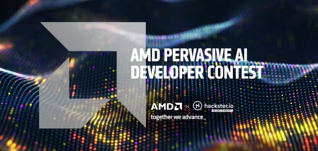
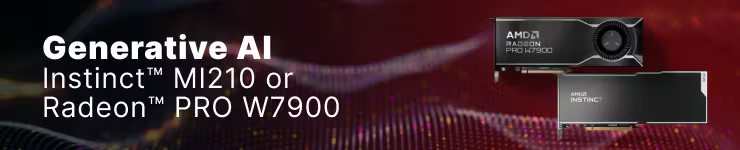

# Hackster - Pervasive AI Developer Contest with AMD

## Table of Contents

1. [Introduction](#introduction)
2. [The Proposal](#the-proposal)
3. [Journals](#journals)
4. [AMD Accelerator Cloud](#amd-accelerator-cloud)
5. [Resources](#resources)

## Introduction

In late 2023, Hackster.io announced the **Pervasive AI Developer Contest** with [AMD as a partner](https://amd.com/).  The [contest page](https://www.hackster.io/contests/amd2023) described a number of prizes, and the opportunity to be awarded AMD hardware for AI development.

I had recently lead a Hackathon team focused on AI/LLM and had started learning more about it. I tested out using [K8sGPT](https://k8sgpt.ai/), which is a tool for scanning your Kubernetes clusters, diagnosing and triaging issues in simple english. I had originally used it with the OpenAI GPT-4 backend to successfully diagnose cluster issues.

I was curious about using it with local LLMs, and K8sGPT supports [multiple backends](https://docs.k8sgpt.ai/reference/providers/backend/), including [LocalAI](https://localai.io/), which is a local model, in an OpenAI compatible API.

I run a [fairly extensive homelab](https://www.linuxtek.ca/2023/03/07/kwlug-presentation-march-2023-homelab-tour/), and have multiple servers with ample resources to run a local [Kubernetes](https://kubernetes.io/) cluster. I had also recently build a [brand new workstation](https://www.linuxtek.ca/2024/04/08/after-12-years-new-desktop-workstation/), which was fully AMD based, and had enough resources to run an [AMD Radeon Pro W7900 Professional](https://www.amd.com/en/products/graphics/workstations/radeon-pro/w7900.html) GPU to test Large Language Models (LLM) locally.

I had been interested in automating and building on my homelab, and this contest was a fun way to motivate me to experiement with these tools.

This repository will contain all of the work, code, and insights I gain as I go thorugh the process.

## The Proposal

[My Proposal](https://www.hackster.io/contests/amd2023/hardware_applications/16336) for the contest was to set up a local Kubernetes cluster, and set up K8sGPT to use LocalAI instead of a cloud-based LLM, powered by AMD AI hardware.

I submitted my proposal for **Category 1: Generative AI with AMD GPUs** in November 2023.

My hope is that as I get things working, I'm able to contribute back to some of these projects, and test some additional functionality than what is currently built in. I will document all progress in my [journals](./journals/), and the relative section README files.

## Journals

All of the weekly journals documenting my progress can be found [here](./journals/).

## AMD Accelerator Cloud

Currently I am testing running LocalAI on the [AMD Accelerator Cloud](https://aac.amd.com/), using the [AMD Instinct MI210 Accelerators](https://www.amd.com/en/products/accelerators/instinct/mi200/mi210.html).

I've documented the process for getting LocalAI set up and running as a workloud in [this README](./amd-accelerator-cloud/README.md).

## Resources
* [Hackster Contest - Pervasive AI Developer Contest ](https://www.hackster.io/contests/amd2023#challengeNav)
* [Hackster Contest Submission - Local Kubernetes Cluster Troubleshooting Assistant](https://www.hackster.io/contests/amd2023/hardware_applications/16336)
* [Kubernetes Website](https://kubernetes.io/)
* [K8sGPT Website](https://k8sgpt.ai/)
* [LocalAI Website](https://localai.io/)

