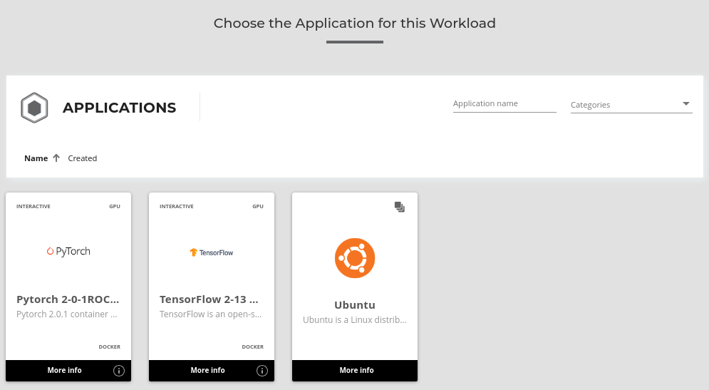
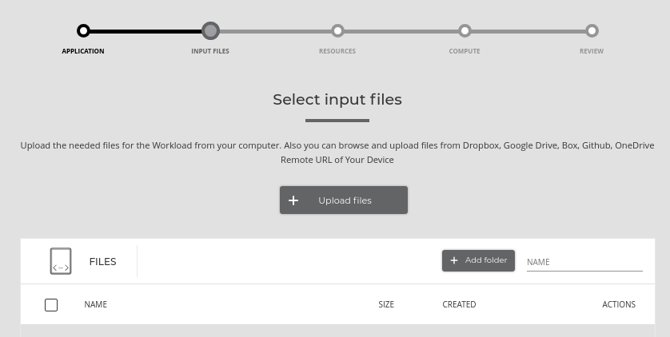
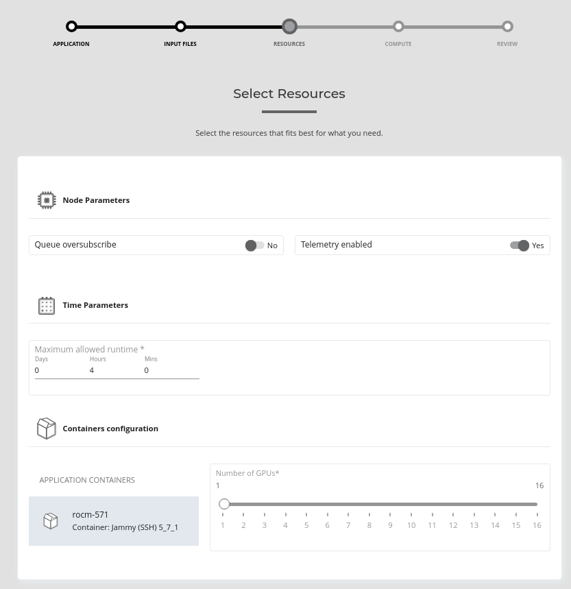
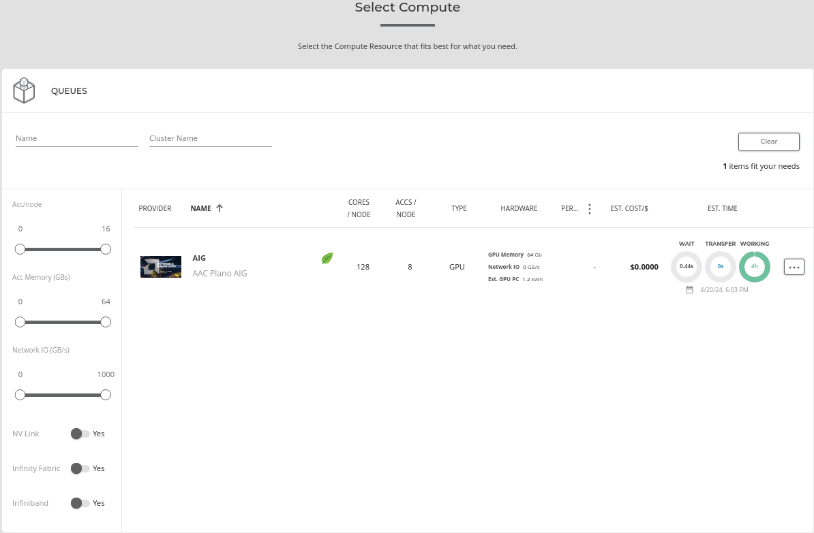
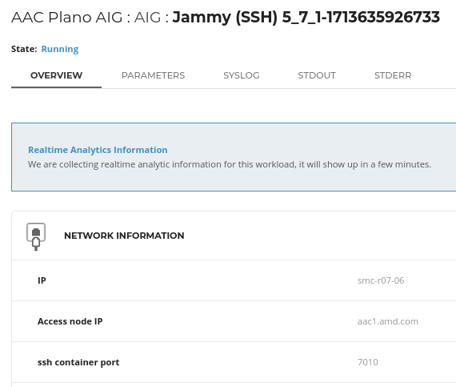
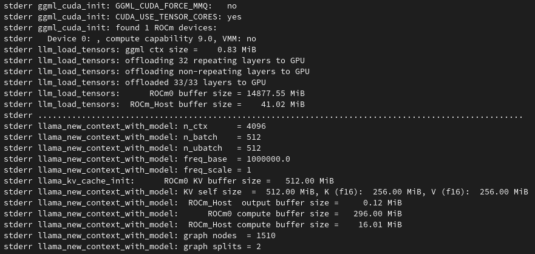
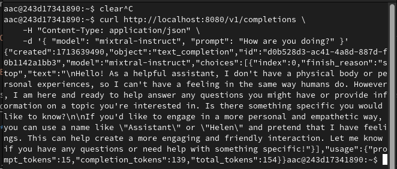
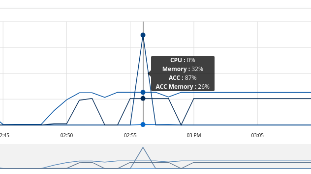
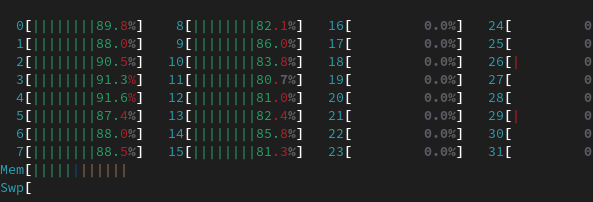
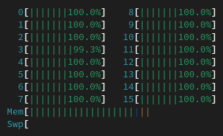

# AMD Accelerator Cloud Setup

## Table of Contents
1. [Introduction](#introduction)
2. [Considerations](#considerations)
    1. [AMD Accelerator Cloud Limitations](#amd-accelerator-cloud-limitations)
    2. [LocalAI Limitations](#localai-limitations)
3. [Launching Workloads](#launching-workloads)
4. [Installing](#installing)
5. [Adding Models](#adding-models)
6. [Testing Queries](#testing-queries)
7. [SSH Tunneling](#ssh-tunneling)
8. [Troubleshooting](#troubleshooting)
9. [Next Steps](#next-steps)
10. [Resources](#resources)

## Introduction
My [project proposal](https://www.hackster.io/contests/amd2023/hardware_applications/16336) was to use a Local LLM powered by a Radeon Pro W7900 to interact with Kubernetes via K8sGPT. 

Unfortunately, there was some confusion around my proposal, and I was instead provided access to use a Cloud based GPU on the AMD Accelerator Cloud, specifically the AMD Instinct MI210.

I was provided a login to the AMD Accelerator Cloud, and the ability to create containerized workloads.  

For interactive workloads, we were given access to a number of Ubuntu container images with the [AMD ROCm Software](https://www.amd.com/en/products/software/rocm.html) installed.

This section will be used for documenting the setup and configuration of a [LocalAI](https://localai.io/) solution on AMD Accelerator Cloud, to integrate with [K8sGPT](https://k8sgpt.ai/).

## Considerations

### AMD Accelerator Cloud Limitations
With the access we were provided, we were only able to create workloads for PyTorch, Tensorflow, or interact with an Ubuntu Docker container:



These workloads had a lifespan limit of 4 hours, and currently access to only one GPU.

Because we were not able to pull Docker images to run from a repository, or load a custom Docker image with all of our dependencies already created, we were told we would have to script any additional software, libraries, or dependencies to run at the beginning of the workload.  

This would mean that every time we started a new workload, we would have to reinstall and rebuild all of our software, which took a considerable amount of time.

Fortunately, the Ubuntu containers we could create had access to 16 cores on an AMD EPYC 7763 64-Core Processor, 64GB RAM, and a shared +40TB of disk space. 

We could persist our home directory data between workloads, which would mean we wouldn't have to repeatedly download LLM model data.  

I did make some tweaks to ensure the build process used as many cores as possible.

### LocalAI Limitations

From reviewing the [LocalAI documentation](https://localai.io/), the most common way to quickly start using it is by launching a [pre-built Docker image](https://localai.io/docs/reference/container-images/). There are even ["All-In-One" images](https://localai.io/docs/reference/aio-images/) with a pre-configured set of models and backends.

Unfortunately due to the restrictions on AMD Accelerator Cloud, we would not be able to use these pre-built containers.

The [GPU Acceleration Page](https://localai.io/features/gpu-acceleration/) for LocalAI also noted that for AMD acceleration, there were no specific container images, and we would need to [build the local-ai binary from source](https://localai.io/basics/build/#Acceleration). That said, there is a section for [AMD GPU](https://localai.io/docs/reference/container-images/) containers on the "Available Containers" page, so worth a try if you want to use Docker.

There was an example on the documentation page for building LocalAI using [Hipblas](https://github.com/ROCm/hipBLAS) for use with AMD GPU with ROCm, however it was done on Arch Linux, and the steps needed to be converted to Ubuntu.

## Launching Workloads

### Launching Workloads on AMD Accelerator Cloud

I followed [these steps](https://github.com/amddcgpuce/AMDAcceleratorCloudGuides/blob/main/PlexusQuickStartGuide/How_To_Launch_Jammy(SSH)_Application.md) from the AMDAcceleratorCloud Github Plexus Quick Start Guide to launch an Ubuntu Jammy instance via the web interface.  After [logging in](https://aac.amd.com/signin), I went to **Workloads**, and selected **New Workload**. I chose Ubuntu, and selected the latest build, which is a Jammy 22.04 instance with a 5.7.1 Kernel, and the AMD ROCm packages built in. The **Next** and **Back** buttons are in the top left/right of the page.

You can select input files, but I preferred to pull down my files from Github.  The home directory files will persist between workloads, so if you have some model or training data, that can be reused.



After selecting files, you can tune the resources parameters.  By default the workload will run for 1 hour, and we can increase this to 4 hours.
Although it looks like we can allocate multiple GPUs, we were asked to only use one, to ensure there would be enough resources for everyone.



Next, we were able to select the queue and cluster to run on.  We had access to the **AAC Plano AIG** cluster, which had 128 CPU cores.  For our container, we could specify up to 16 cores to use, and up to 64GB RAM.



After reviewing the configuration, we were able to run the workload.  It took a few seconds to prepare, send to the cluster, and start up.  If there were more jobs waiting in the queue, it might take longer to run.

By going to the [Workloads tab](https://aac.amd.com/jobs/all) at the top of thepage, we could see all of the currently running, and previous workloads.  Once the workload was running, clicking on it provided the network information to connect via SSH on a specific port:



For connecting via SSH, we were not able to import a public key, but were provided a randomly generated password, available under **Interactive Endpoints** on the right side of the window:


From our own computer, we could SSH into the Ubuntu instance using:

`ssh aac@aac1.amd.com -p <port>`

And then entering the password provided.

## Installing

As the launched Ubuntu instance did not have the needed software, I created a manual script to install the necessary software and build the LocalAI binary from source.

This took a lot of trial and error, as there were a number of prerequisites.  The script can be found here: **[config-localai.sh](./config-localai.sh)** and must be run with `sudo`.

Here is a quick rundown of some of the nuances of the upgrade script:

* The script will need to manually remove Golang, and manually install 1.22, as the verison available in apt respositories is not new enough.

* By default, only one core was used for much of the make/cmake compiling.  I added the `-j16` flag to the build command to get it to use all 16 available CPU cores to build.

* I added the `export CMAKE_BUILD_PARALLEL_LEVEL=16` environment variable, to ensure that cmake would use all available CPU cores to build.  This is one of the longest portions of the build process, as building [grpc from source](https://github.com/grpc/grpc/blob/master/BUILDING.md) is quite intensive, and had a lot of dependencies to run successfully.

* Building LocalAI from source needs the `BUILD_GRPC_FOR_BACKEND_LLAMA=ON` flag set, to ensure GRPC is built from scratch.  There were a number of [closed issues](https://github.com/mudler/LocalAI/issues/1579) that documented this as a solution.

* For AMD GPU support, we would be building with the `BUILD_TYPE=hipblas`.

* For the GPU Target, this was a bit confusing, as I assumed it would be mi210.  But after reviewing the LLVM Compiler Infrastructure [User Guide](https://llvm.org/docs/AMDGPUUsage.html) for AMD GPU Backend, the [AMD Instinct MI210 Accelerator](https://www.amd.com/en/products/accelerators/instinct/mi200/mi210.html) is actually grouped under **gfx90a**, so we set `GPU_TARGETS=gfx90a`.

* The script needed to be run with elevated permissions to install all of the required dependencies.  Because of this, all of the files are also permissioned to root.  The final steps is to change ownership of the LocalAI folder so `sudo` does not need to be used to execute the program.

Once the script finishes successfully, the **local-ai** binary should be available to run in the LocalAI folder.

## Adding Models
The [LocalAI Quickstart Documentation](https://localai.io/basics/getting_started/) talks about the "All-In-One" image being pre-configured with a set of models and backends.  When building from source, I found that the links to those models were present, and running a query would attempt to load them, but there were no models available.  The documentation does includes a section for [running your own models manually](https://localai.io/docs/getting-started/manual/) using a YAML file. There are a number of sample model YAML files available in the LocalAI Github Repo [here](https://github.com/mudler/LocalAI/tree/master/embedded/models).

I chose to test with the **mistralai/Mixtral-8x22B-Instruct-v0.1** LLM, which is available on [HuggingFace](https://huggingface.co/mistralai/Mixtral-8x22B-Instruct-v0.1). To do this, I created a **models** directory in my home directory, and added the [mixtral-instruct.yaml](https://github.com/mudler/LocalAI/blob/master/embedded/models/mixtral-instruct.yaml) file.

To run LocalAI and use this model, I ran the following from the OpenAI directory:  `./local-ai --models-path=~/models/ --debug=true`

The model was automatically downloaded to the **models** directory, and took up about 15GB of space:


## Testing Queries
Once OpenAI was running and the Mixtral LLM enabled, You could see the endpoint for LocalAI was listening on `http://0.0.0.0:8080`.

The [LocalAI Getting Started](https://localai.io/basics/getting_started/) page has a number of sample queries you can use via curl to send a query to LocalAI.  I modified the model, and tested this:

```
curl http://localhost:8080/v1/completions \
    -H "Content-Type: application/json" \
    -d '{ "model": "mixtral-instruct", "prompt": "How are you doing?" }'
```

Once this was passed to LocalAI, the LLM was loaded into memory, which took a few minutes the first time. I could see in the debug data, that the LLM was successfully offloaded to the GPU:



After a few minutes, I was able to receive the response from the LLM.  The debug window showed a successful POST HTTP 200 for the request, and the response was returned in my SSH window:



From reviewing the workload details, we can see the real-time analytics, and see the spike in GPU processing and memory usage during the query being processed, while the CPU stays flat.  

This confirms the LLM processing is being offloaded to the GPU:



## SSH Tunnelling

Because the AMD Accelerator Cloud can only be accessed via the web interface, and we are only able to SSH into the direct workload container, and not expose custom ports, in order to use the running LocalAI program "locally" with my Kubernetes clusters, I created an SSH tunnel using local port forwarding from my local machine that would be running [K8sGPT](https://k8sgpt.ai/) to the running workload using the following command:

```
ssh -L [LOCAL_IP:]LOCAL_PORT:DESTINATION:DESTINATION_PORT [USER@]SSH_SERVER

ssh aac@aac1.amd.com -p 7010 -L 8080:127.0.0.1:8080
```

This allowed me to send the requests to the running LocalAI program on localhost:8000 on my own machine to the running workload on AMD Accelerator Cloud.

## Troubleshooting

Initially, building from source would fail due to missing prerequisites, as some of the package names needed to build from source were only documented for Arch Linux.  I was able to use the error messages to figure out what was missing, and found ways to include them in the OS prior to building.  

I found the [LocalAI Github Issues](https://github.com/mudler/LocalAI/issues) section very helpful for troubleshooting, as many of the error messages I found could be searched there and some steps provided to fix.

For example, I ran into this error:

```
-- CMAKE_SYSTEM_PROCESSOR: x86_64
-- x86 detected
CMake Error at examples/grpc-server/CMakeLists.txt:26 (find_package):
  Could not find a package configuration file provided by "Protobuf" with any
  of the following names:

    ProtobufConfig.cmake
    protobuf-config.cmake

  Add the installation prefix of "Protobuf" to CMAKE_PREFIX_PATH or set
  "Protobuf_DIR" to a directory containing one of the above files.  If
  "Protobuf" provides a separate development package or SDK, be sure it has
  been installed.
```

This was due to missing `libabsl-dev`, and [this issue](https://github.com/mudler/LocalAI/issues/1386) had a lot of good troubleshooting steps to try.

Building gRPC from source was probably the hardest, and took the longest, as it switched to using cmake.  
The `BUILD_GRPC_FOR_BACKEND_LLAMA=ON` flag was needed, but [the documentation](https://localai.io/basics/build/) stated to use `true`, which failed.  I will look at getting this fixed.

Also had trouble with this error:


This was caused by a partial build directory being maintained between launching workloads, or failed builds.  
Initially I added a `make clean` step before building, but ended up checking and removing the LocalAI folder if it persisted from a previous workload, to avoid problems.

Once I did get everything to build successfully, it took an extremely long time, and I noticed that only one CPU core was typically being used, and a lot of the time it was sitting idle:


It probably took an hour to build the first time it got into building gRPC, before failing.  I did some research, and added the `-j16` to the build command, which got the first part of the build using all 16 cores allocated to the container, but the gRPC build was still slow.  I eventually was able to add an explicit `export CMAKE_BUILD_PARALLEL_LEVEL=16` command, based on [this article](https://cmake.org/cmake/help/latest/envvar/CMAKE_BUILD_PARALLEL_LEVEL.html) to ensure the setting would be used by the called build.  Once this was done, I could see all 16 cores used during the gRPC build:




## Next Steps

Now that I am able to get LocalAI running on AMD Accelerator Cloud and leverage the compute resources, the next steps are to get K8sGPT integrated to use it, and then start adding and tweaking models to get better responses.

This will require getting some test cases set up on my Kubernetes clusters to "break", in order to have K8sGPT scan for them, send the requests to LocalAI, and get the human-readable responses.

## Resources
* [AMD Accelerator Cloud Github - Plexus Quick Start Guide](https://github.com/amddcgpuce/AMDAcceleratorCloudGuides/tree/main/PlexusQuickStartGuide)
* [LocalAI Documentation](https://localai.io/)
* [LocalAI Github](https://github.com/mudler/LocalAI)
* [LocalAI - Manual Build From Source](https://localai.io/basics/build/index.html)
* [gRPC Github](https://github.com/grpc/grpc)
* [LLVM - AMDGPU Backend Documentation](https://llvm.org/docs/AMDGPUUsage.html)
* [Hugging Face - Downloading Models](https://huggingface.co/docs/hub/models-downloading)
* [Hugging Face - Mixtral-8x22B-Instruct-v0.1](https://huggingface.co/mistralai/Mixtral-8x22B-Instruct-v0.1)
* [How to set up SSH tunneling](https://linuxize.com/post/how-to-setup-ssh-tunneling/)