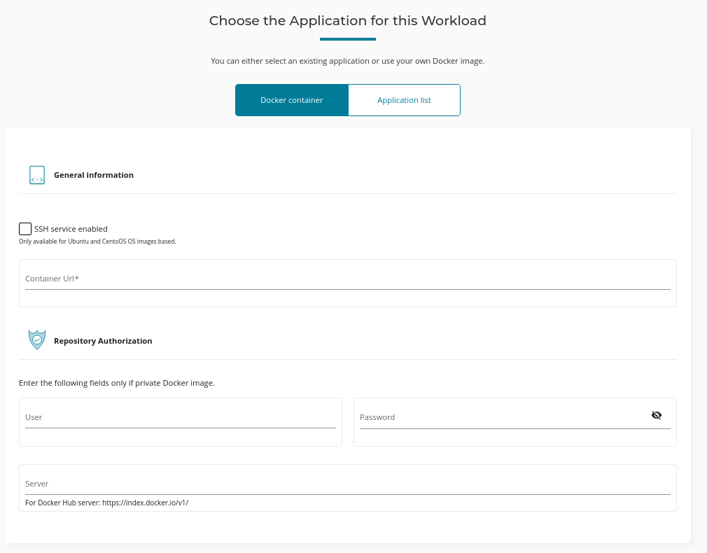
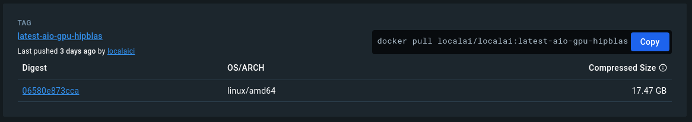

# Docker Containers on AMD Accelerator Cloud

## Introduction

In July, AMD added the ability to launch custom Docker containers on AMD Accelerator Cloud. This feature is currently in beta, but we were granted access to test it.

This allowed running custom images, rather than having to use the stock Ubuntu ROCm image and installing all of the needed software inside the container.

The amount of time a workload could run on AMD Accelerator Cloud was also increased from 4 hours to 8 hours.

## Running Custom Images

When starting a workload, we can now choose a **Docker Container** for using our own Docker image:



* We can enable SSH for Ubuntu and CentOS based images.

* From Docker Hub, the latest "All In One" LocalAI image for AMD GPUs is:  `localai/localai:latest-aio-gpu-hipblas`.  For an image without pre-installed models there is `localai/localai:latest-gpu-hipblas`.

* After choosing the parameters and running the workload, it takes about [10 minutes](../../media-assets/aac-loading-hipblas.png) to fully download and launch the container.  This is because the full image is quite large:



* Once the image is downloaded and ready, we can SSH into the container (and also set up local port forwarding):

```
ssh -L [LOCAL_IP:]LOCAL_PORT:DESTINATION:DESTINATION_PORT [USER@]SSH_SERVER

ssh aac@aac1.amd.com -p 7010 -L 8080:127.0.0.1:8080
```

## Concerns

Currently there is no way on the web interfact to specify parameters to load into your Docker container when launching the workload.

For example, when launching LocalAI, I would need to specify environment variables to set `GPU_TARGETS=gfx90a` value to match the AMD Instinct MI210 card.

Although the image does launch, and I can SSH into the container, the LocalAI executable does not run, and I am not able to query the API endpoint locally.

This would require more testing and troubleshooting, however this is complicated by additional issues:

* IP access issues, where my ISP IP is being blocked.  I am able to SSH into the container when using a VPN, but not directly.

* The AAC Plano AIG cluster is currently queueing all workloads, and they are stuck on Pending, and unable to run.  I don't have access to see the queue length, to know when my workloads will run.