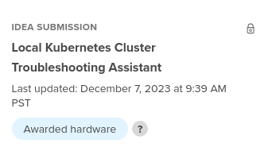
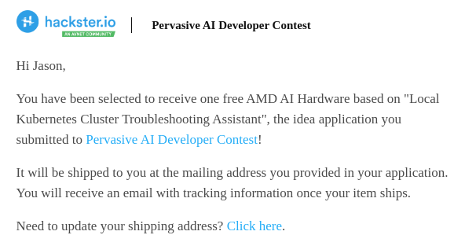
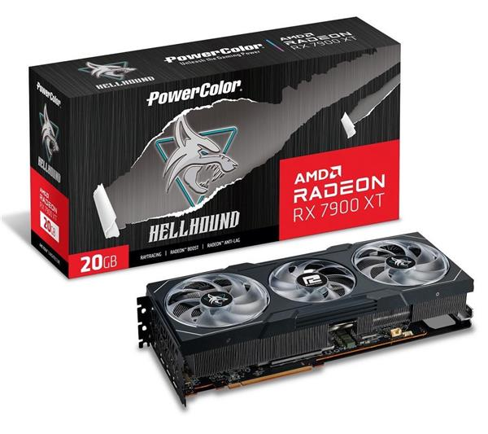
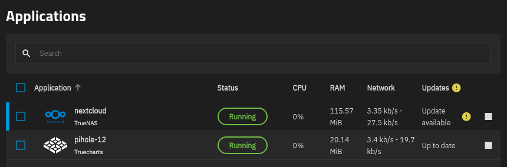
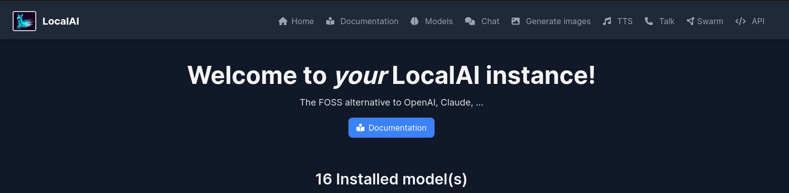
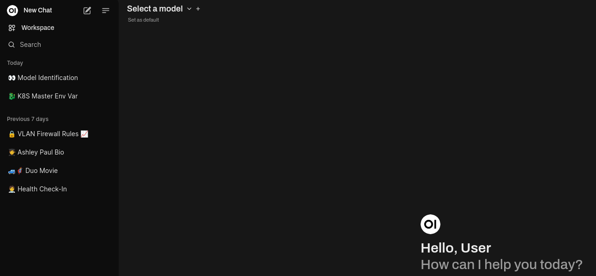

# Locally Runnning LLMs with AMD GPU 

## Introduction

The main goal of this project was to get an LLM running locally to interact with K8sGPT, in order to troubleshoot Kubernetes errors.

## Hardware

As part of the [AMD Pervasive AI Developer Contest](https://www.hackster.io/contests/amd2023#challengeNav), I applied for hardware to use, hoping to receive an [AMD Radeon Pro W7900](https://www.amd.com/en/products/graphics/workstations/radeon-pro/w7900.html) card.  I was excited to be notified that I had been awarded hardware:

However, due to some confusion, I was instead awarded access to the AMD Accelerator Cloud, to temporarily use the [AMD Instinct MI210 Accelerator](https://www.amd.com/en/products/accelerators/instinct/mi200/mi210.html) GPU. As the goal of this project is local AI, this didn't make a lot of sense. I did experiment with the AMD Accelerator Cloud, and provide some details on using it in the [amd-accelerator-cloud](../amd-accelerator-cloud/) directory.

For local hardware, I am using my own GPU - a [PowerColor Hellhound Radeon RX 7900 XT 20GB GDDR6](https://www.powercolor.com/product?id=1668741687):

## Software

* [K8sGPT supports LocalAI](https://docs.k8sgpt.ai/reference/providers/backend/#localai), which is an OpenAI compatible API. 
* [Ollama](https://ollama.com/) is another popular choice for running multiple large language models locally, however [OpenAI API compatibility is currently experimental](https://github.com/ollama/ollama/blob/main/docs/openai.md).  Because of this, I opted to use LocalAI.
* The [LocalAI Documentation](https://localai.io/basics/try/) has some examples on how you can make a call to the API with a prompt in command line.  This works, but isn't very user friendly.  For a web frontend, I set up [Open WebUI](https://openwebui.com/)  to interface with LocalAI.  This allowed a nice web interface to test OpenAI compatible API calls, as well as interface with the various models I was testing.
* For Kubernetes testing, I wanted to build a full cluster on Proxmox that was fully defined as code, with automated deployments and updates. Unfortunately this ended up being out of the scope of this project, as I ran into some local networking issues that I am still troubleshooting, and building out a full codebase for this could not be done in time.
* Instead, I am testing against my [TrueNAS SCALE](https://www.truenas.com/truenas-scale/) server, which runs [Rancher K3s](https://www.rancher.com/products/k3s) for its applications. The applications are contained in a registry and are deployed using Helm charts:

## Configuration Instructions

For local testing, I created a [docker-compose.yml](./docker-compose.yaml) file, which defines the LocalAI and Open WebUI containers to run. This includes a number of specific environment variables, volumes, ports, etc. This may need to be reconfigured for your local machine.

* The `GPU_TARGETS` environment value should be set to your AMD GPU processor type, as per the [LLVM PRocessors](https://llvm.org/docs/AMDGPUUsage.html#processors) list.  In my case, the Radeon RX 7900XT is an RDNA3 (NAVI31) cards, and is considered `gfx1100`, so this is what I set.

* My workstation CPU is an AMD Ryzen 7 7800X3D, which includes a 2 core GPU.  By default, LocalAI would attempt to load a model onto this GPU, which would crash due to lack of memory. This took a lot of time to troubleshoot, as the [llama.cpp](https://github.com/ggerganov/llama.cpp) interface did not throw any helpful information. To avoid accidentally trying to load an LLM, I set `HIP_VISIBLE_DEVICES=0`, to ensure that only my Radeon GPU would be available.

* I also had to set the access to the GPU device for the Docker container. As per the [AMD ROCm Documentation](https://rocm.docs.amd.com/projects/install-on-linux/en/latest/how-to/docker.html), you can restrict or grant access to the GPU. 

* The device `/dev/kfd` is the main compute interface, shared by all GPUs, and the `/dev/dri` device contains the Direct Rendering Interface for each GPU. You can also set the specific GPU individually by referenceing `/dev/dri/renderD<node>`, which in my case was `/dev/dri/renderD128`. Check your filesystem and `lspci` to ensure you allow/restrict to the correct hardware.

* The latest LocalAI Docker image includes [AMD ROCm 6.1](https://www.amd.com/en/products/software/rocm.html), and is built off the AMD released Ubuntu 22.04 image.

* Any models downloaded by LocalAI will be stored in the local directory under `./models`.  Depending on the models downloaded and used, this can get quite large, so specify another location if you will not have enough space.

* The settings for Open WebUI will be stored in the `./open-webui` folder. This will include user configuration, RBAC settings, and other integrations. If you have a preference on where to permanently store the configuration files, specify another location.

* Normally Open WebUI will have you create a user on first login, and then restrict access to just that user.  Since I am only running this locally for myself, I set the `WEBUI_AUTH=false` environment variable.  If you want multiple users to have access, or restrict access to some models, you can set this to true and configure other options. Network Chuck has a [great video](https://youtu.be/Wjrdr0NU4Sk?si=H2WoEPfHYndJHteT) on how to use Open WebUI (with Ollama).

* I set LocalAI to run on port 8080, and Open WebUI to run on port 3000.  You can change these under the `ports` section for each container if needed.

* I also set a fake OpenAI API key as `abc123` for the two applications to communicate with.  Since this is all locally hosted, it wasn't critical, but if you will be sharing access to the machine running the LLM, you can lock this down tighter.

## Usage

Once your docker-compose.yaml file is properly adjusted for your system, you can just run: `docker compose up` in this directory.  It should launch both containers, and you should see terminal feedback showing they are available. 

In a web browser, you can check LocalAI using [http://localhost:8080](http://localhost:8080), as it does include a web interface. You can get a quick list of the available models using [http://localhost:8080/v1/models](http://localhost:8080/v1/models).

In a web browser, you can access Open WebUI using [http://localhost:3000](http://localhost:3000). 

There are a lot of configuration options, and it is easy to choose a model using the dropdown, and start typing prompts.

Once both of these containers are running successfully, you can set up K8sGPT to work with LocalAI. 

Documentation for this can be found in the [K8sGPT](../k8sgpt/) section of this repository.

## References

Documentation
* [K8sGPT Documentation - LocalAI Backend](https://docs.k8sgpt.ai/reference/providers/backend/#localai)
* [LocalAI Documentation](https://localai.io/)
* [Open WebUI Documentation](https://docs.openwebui.com/)
* [Ollama Github](https://github.com/ollama/ollama/)
* [TrueNAS SCALE Documentation](https://www.truenas.com/docs/scale/)
* [AMD ROCm Documentation - Running ROCm Docker Containers](https://rocm.docs.amd.com/projects/install-on-linux/en/latest/how-to/docker.html)
* [Github - AMD ROCm Docker Repository](https://github.com/ROCm/ROCm-docker)
* [YouTube - Network Chuck - Host all your AI locally](https://youtu.be/Wjrdr0NU4Sk?si=H2WoEPfHYndJHteT)
