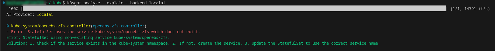

# K8sGPT Installation Guide

## Prerequisites

K8sGPT can store authentication information to access your local LLM, as well as your Kubernetes cluster.

kubectl should already be installed and configured with a .kubeconfig file, and K8sGPT will use this to access the clusters.

## Kubectl Installation

In my case, I am testing against my TrueNAS SCALE server, which is running [Rancher k3s](https://www.rancher.com/products/k3s) for applications. This will be changing to docker-compose in TrueNAS SCALE Electric-Eel 24.10, as per [this forum announcement](https://forums.truenas.com/t/the-future-of-electric-eel-and-apps/5409).

I installed kubectl using the [official documentation](https://kubernetes.io/docs/tasks/tools/install-kubectl-linux/#install-using-native-package-management), using the native package management option.

```
$ kubectl version
Client Version: v1.30.3
Kustomize Version: v5.0.4-0.20230601165947-6ce0bf390ce3
Server Version: v1.26.6+k3s-6a894050-dirty
```

## Kubectl Configuration

As I am connecting to TrueNAS SCALE for testing, in order to connect remotely, there are some steps needed.

1. SSH into the TrueNAS SCALE server as root.

2. Check that k3s is listening on port 6443 using the command `ss -tlen | grep :6443`

3. By default it is open, but protected by iptables via a rule.  This rule can be dropped using the following command:

```
iptables -D INPUT -p tcp -m tcp --dport 6443 -m comment --comment "iX Custom Rule to drop connection requests to k8s cluster from external sources" -j DROP
```

4. Copy the kubeconfig file on the TrueNAS SCALE server from /etc/rancher/k3s/k3s.yaml to your local machine. I added it to ~/.kube.

5. Edit this file, and change the server line to point to your TrueNAS server IP address.

6. Update the KUBERNETES_MASTER environment variable to point to this endpoint.  In my case, I added the following environment variables to load via my .bashrc file:

```
# Set Environment Variables for Kubernetes
export KUBECONFIG=~/.kube/k3s.yaml
export KUBERNETES_MASTER="http://truenas-ip-address:6443"
```

7. Testing when loading a new bash shell with these environment variables to confirm I can access the cluster:

```
$ kubectl get pods -A
NAMESPACE      NAME                                     READY   STATUS            RESTARTS        AGE
kube-system    snapshot-controller-546868dfb4-j9nqc     0/1     TaintToleration   0               110d
kube-system    snapshot-controller-546868dfb4-82fbc     0/1     TaintToleration   0               110d
kube-system    csi-smb-node-ncfnm                       3/3     Running           9 (9d ago)      219d
kube-system    csi-nfs-node-bdlvp                       3/3     Running           3 (9d ago)      110d
kube-system    openebs-zfs-node-rcxtg                   2/2     Running           0               9d
kube-system    svclb-pihole-12-dns-tcp-a6d33b0e-cqq56   1/1     Running           0               9d
kube-system    svclb-pihole-12-dns-1b152111-mktfq       1/1     Running           0               9d
```

## K8sGPT Installation

For my setup, I am installing K8sGPT as a local binary on my Linux Desktop running Fedora 40.  
The [k8sgpt documentation installation guide](https://docs.k8sgpt.ai/getting-started/installation/) has steps for other environments.

To do this, I downloaded the RPM and manually installed it:

```
curl -LO https://github.com/k8sgpt-ai/k8sgpt/releases/download/v0.3.24/k8sgpt_amd64.rpm
sudo rpm -ivh -i k8sgpt_amd64.rpm
```

After downloading and installing the RPM file, I confirmed the version:

```
$ k8sgpt version
k8sgpt: 0.3.24 (eac9f07), built at: unknown
```

## K8sGPT Configuration

* K8sGPT will need to be able to access both your local LLM, as well as your Kubernetes clusters.

* Access to the Kubernetes cluster should be set up as above using the kubectl configuration.

* As we are using LocalAI on our local machine, we can set a backend configuration using the gpt-4 model using the following command:

`k8sgpt auth add --backend localai --model gpt-4 --baseurl http://localhost:8080`

* To test everything is working properly, we can run the following: `k8sgpt analyze --explain --backend localai`



## References

* [Blog Post - TrueNAS Installing Kubectl](https://sbulav.github.io/truenas/truenas-installing-kubectl/)
* [Kubernetes Documentation - Installing kubectl on Linux](https://kubernetes.io/docs/tasks/tools/install-kubectl-linux/)
* [K8sGPT Documentation - Installation Guide](https://docs.k8sgpt.ai/getting-started/installation/)