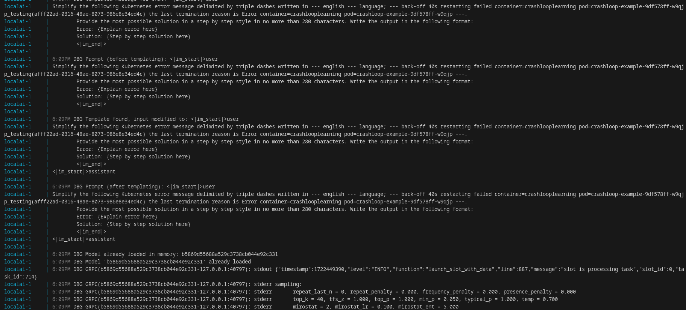

# Kubernetes Troubleshooting Examples

## Introduction 

For testing k8sgpt, it is helpful to have some failing deployments for the program to analyze.  

I used some of the examples from [this video](https://youtu.be/vGab4v3RWEw) from [Abhishek Veeramalla's](https://www.youtube.com/@AbhishekVeeramalla) YouTube series on Kubernetes Troubleshooting.

I've cloned the repository in this directory for easy access.

I also created a namespace "testing" on my Kubernetes cluster using the command:  `kubectl create namespace testing`

## Example 1 - ImagePullBackOff

1.  Apply the [following deployment](./01-imagepullbackoff-test.yml) from the [Kubernetes documentation example](https://kubernetes.io/docs/concepts/workloads/controllers/deployment/#creating-a-deployment), which includes an intentional spelling mistake on the image name - "nginy" instead of "nginx":

```
kubectl apply -f 01-imagepullbackoff-test.yml -n testing
```

After a few minutes, we can see the deployment is running, and the pods are in ImagePullBackOff:


2. Run K8sGPT to analyze and explain the failure using this command: `k8sgpt analyze --explain --namespace=testing --backend localai`


From this, we can see that K8sGPT detects the errors, highlights the incorrect imgae name, and even provides a potential sollution in changing the image name from "nginy" to "nginx".


## Example 2 - CrashLoopBackOff

1. Deploy the [01-wrong-cmd-crashloop.yml](./kubernetes-troubleshooting-zero-to-hero/02-CrashLoopBackOff/01-wrong-cmd-crashloop.yml) deployment to your Kubernetes cluster using this command:

`kubectl apply -f 01-wrong-cmd-crashloop.yml -n testing`

2.  Verify the pod is created and is in CrashLoopBackOff using: 

```
kubectl get pods -n testing
kubctl get deployments -n testing
```

The output shows it is crashing:

```
$ kubectl get pods -n testing

NAME                               READY   STATUS             RESTARTS      AGE
crashloop-example-9df578ff-klxkg   0/1     CrashLoopBackOff   1 (18s ago)   41s
```

3.  Run k8sgpt to analyze the pod: `k8sgpt analyze --explain --namespace=testing --backend localai`

I can see in the LocalAI terminal window that K8sGPT has passed a prompt to the LLM with templating to get clarification on the error:



The return in my command terminal shows K8sGPT provides the error and solution returned from LocalAI:


4. Remove the crashing deployment from the namespace:

```
kubectl get deployments -n testing
kubectl delete deployment crashloop-example -n testing
```
## References

* [Youtube -Abhishek Veeramalla - Kubernetes Troubleshooting](https://youtu.be/vGab4v3RWEw?si=suBkjt-kXfB_tq4b)

